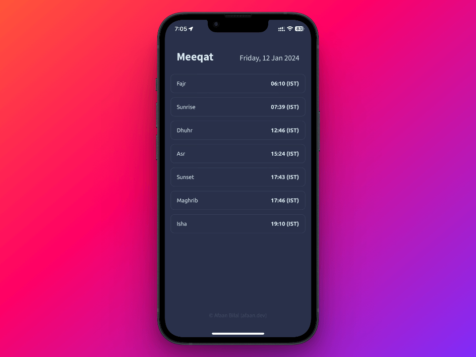

Meeqat
======

Author: **[Afaan Bilal](https://afaan.dev)**

## Introduction
**Meeqat** is a mobile app to display Prayer Times using React Native and TypeScript.

---

## Screenshots

---

## Contributing
All contributions are welcome. Please create an issue first for any feature request
or bug. Then fork the repository, create a branch and make any changes to fix the bug
or add the feature and create a pull request. That's it!
Thanks!

---

## License
**Meeqat** is released under the MIT License.
Check out the full license [here](LICENSE).
